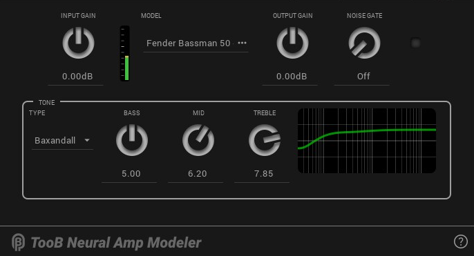
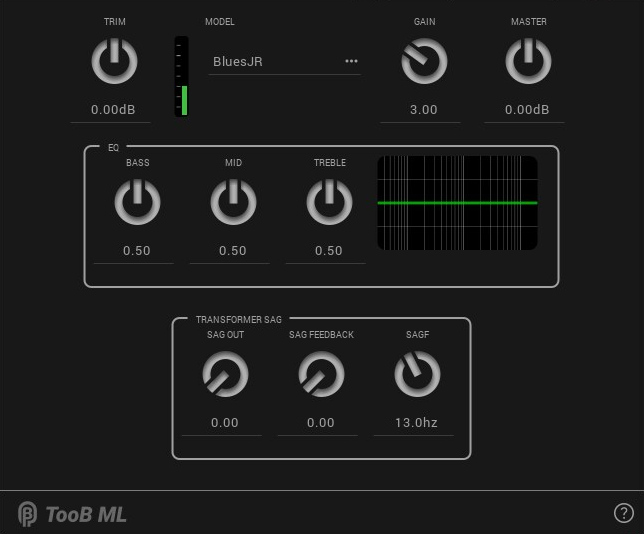
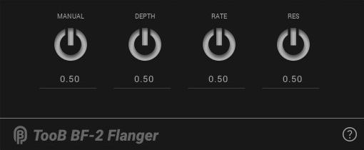
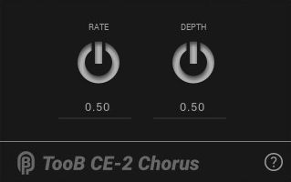
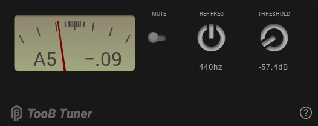

# ToobAmp LV2 Guitar Amp Plugins

### v1.1.61

The ToobAmp Project provides 22 high-quality LV2 audio plugins designed for use as guitar effects. The set of plugins provides a 
no-nonsense, foundation set of effects pedals to get you started. The plugins are primarily designed for use with the [PiPedal](https://github.com/rerdavies/pipedal) project; but they also provide native X11/Cairo user-interfaces that allow them to be used with other LV2 plugin hosts and DAWs too.

- Neural Network Amp Models (TooB NAM, and TooML plugins).
- Reverb. TooB Convolutin Reverb (mono and stereo), and TooB Freeverb
- Loopers (TooB 4Looper, and One-Button Looper).
- Cab simulators (TooB Cab IR, and TooB CabSim).
- Modulation/delay effects (TooB Delay, CE-2 Chorus, and BF-2 Flanger).
- Utility plugins (TooB Input Stage, TooB Tuner, TooB Spectrum Analyzer, and TooB Input Recorder).

Note that PiPedal always includes the latest ToobAmp plugins, so you should not install ToobAmp plugins on top of an existing PiPedal install.

# Releases Notes
### v1.1.61
New in this release:

- Added TooB Noise Gate plugin.
- Added TooB Mix plugin.
- Added TooB Volume plugin.

### v1.1.60
Bug fixes:
- Improvements to TooB Tuner stability and accuracy.
- TooB Tuner: Correct pitch detection of notes above Bb4 

### v1.1.59 
- NEW TooB 4Looper, TooB One-Button Looper and TooB Record Input plugins.  
- Fixes for Reaper UI compatibility. 

## Install ToobAmp

Do NOT install ToobAmp over an existing PiPedal install. PiPedal install packages include the latest and best versions of PiPedal plugins already.

ToobAmp has been tested with Raspberry Pi OS Bookworm, and with Ubuntu 22.04 on amd64/x64, and aarch64, but should be compatible 
with other Debian-based Linux distributions.

Downloads:

* [Rasberry PI OS 64-bit Bookworm or later (ARM 64)](https://github.com/rerdavies/ToobAmp/releases/download/v1.1.61/toobamp_1.1.61_arm64.deb)
* [Ubuntu 22.04 or later (ARM 64)](https://github.com/rerdavies/ToobAmp/releases/download/v1.1.61/toobamp_1.1.61_arm64.deb)
* [Ubuntu 22.04 or later (x64/amd64)](https://github.com/rerdavies/ToobAmp/releases/download/v1.1.61/toobamp_1.1.61_amd64.deb)

Download the appropriate package for your sytems. Run the following shell commands to install the packages:

    sudo apt update
    cd ~/Downloads
    sudo apt-get install  ./toobamp_1.1.61_arm64.deb   # adjust as appropropriate
    
Note that you MUST use `apt-get`, and NOT `apt` to install ToobAmp, becaue `apt` will not correctly install dependencies. You can safely ignore the permission warning
given by `apt-get`. 

## Plugins

The ToobAmp package includes the following plugins.

*   **TooB Neural Amp Modeler**

    Guitar amp emulations based on Neural Net modeling. A port of Steven Atkinson's astounding [Neural Amp Modeler](https://github.com/sdatkinson/NeuralAmpModelerCore) to LV2.  
      
    Download model files from [ToneHunt.org](https://tonehunt.org), or (if you're feeling adventurous) [train your own models](https://github.com/sdatkinson/neural-amp-modeler).
    &nbsp;
    
    &nbsp;&nbsp;&nbsp;&nbsp;&nbsp;&nbsp;

    &nbsp;

*   **TooB ML Amplifier**

    Artificial-Intelligence/Machine-Learning-based emulation of a number of different guitar amps and overdrive/distortion
    pedals based on Jatin Chowdhury' ML Amplifier library.

    &nbsp;

    &nbsp;&nbsp;&nbsp;&nbsp;&nbsp;&nbsp;

    &nbsp;

*   **TooB Convolution Reverb**

    Simulates stereo reverb from pre-recorded stereo or Ambisonic b-format impulse response files. Mono and Stereo versions available.

    &nbsp;
    
    &nbsp;&nbsp;&nbsp;&nbsp;&nbsp;&nbsp;

    &nbsp;

*   **TooB Freeverb**

    A particularly well-balanced reverb, based on the legendary Freeverb reverb algorithm. Flexible controls, low coloration, low CPU usage.

    &nbsp;

    &nbsp;&nbsp;&nbsp;&nbsp;&nbsp;&nbsp;

    &nbsp;

*   **TooB BF-2 Flanger**

    Simulates a famous flanger. Available in mono and stereo versions.

    &nbsp;
    
    &nbsp;&nbsp;&nbsp;&nbsp;&nbsp;&nbsp;

    &nbsp;

*   **TooB Cab IR**

    Convolution-based Cab IR simulator, generating cabinetfrequency responses from pre-recorded impulse files.

*   **TooB CE-2 Chorus**

    A faithful digital replica of the Boss CE-2 Chorus.

    &nbsp;
    &nbsp;&nbsp;&nbsp;&nbsp;&nbsp;&nbsp;

    &nbsp;

*  **TooB Noise Gate**

    A flexible Noise Gate, than provide both Noise Gate and 
    Slow Gear effects.

*  ** TooB Mix**

    Remix stereo channels. Independent level and pan position for 
    left and right input channels. 

*  ** TooB Volume**

    A utility plugin to change volume levels of a signal.

*   **TooB Freeverb**

    A particularly well-balanced reverb, based on the famous Freeverb algorithm. Flexible controls, low coloration, low CPU usage.

    &nbsp;

    &nbsp;&nbsp;&nbsp;&nbsp;&nbsp;&nbsp;

    &nbsp;

*   **TooB Tone Stack**

    Guitar amplifier tone stack. Select a Fender Bassman, Marshal JCM800, or Baxandall tone stack.

    &nbsp;

    &nbsp;&nbsp;&nbsp;&nbsp;&nbsp;&nbsp;

    &nbsp;    

*   **TooB Tuner**

    An stable, accurate guitar tuner. 

    &nbsp;

    &nbsp;&nbsp;&nbsp;&nbsp;&nbsp;&nbsp;

    &nbsp;

*   **TooB Spectrum Analyzer**

    Live-signal spectrum analyzer.

    &nbsp;

    &nbsp;&nbsp;&nbsp;&nbsp;&nbsp;&nbsp;

    &nbsp;

*   **TooB Input Stage**

    For initial conditioning of guitar input signals. Trim level, noise-gating, and an EQ section that 
    provides low-pass, hi-pass and bright-boost filtering.

    &nbsp;

*   **TooB Cab Simulator**

    Rather than relying on expensive convolution effects, TooB CabSim provides an EQ section designed to 
    allow easy emulation of guitar cabinet/microphone combinations. 

    &nbsp;

## Building ToobAmp

ToobAmp currently builds for Raspberry Pi OS, and Ubuntu 21.x; but it should be easy to build on any Debian derived distro. Pull requests for builds on other platforms are welcome.

##### Prerequisites

Run the following commands to install prerequisites:

     sudo apt update
     sudo apt install -y build-essential cmake ninja-build git
     sudo apt install -y lv2-dev libboost-iostreams-dev libflac++-dev zlib1g-dev libdbus-1-dev \
        libcairo2-dev libpango1.0-dev catch2 librsvg2-dev liblilv-dev  libxrandr-dev
     

Clone the repository to your local machine.

    cd ~/src  # or wherever you keep your projects
    git clone https://github.com/rerdavies/ToobAmp.git
  

Then, in the project directory, run:

     cd ~/src/ToobAmp
     git submodule update --init --recursive

If you are using Visual Studio Code, you will still need to perform the previous command after 
cloning the project, since Visual Studio Code does not yet understand submodules.

##### Building 

ToobAmp was built using Visual Studio Code, with CMake build files, so it's easier to configure and build 
TooBAmp if you are using Visual Studio Code.

If you are using Visual Studio code, install the Microsoft CMake extension, and load the project directory. Visual Studio Code
will automatically detect and configure the project. Build and configuration tools for the CMake project can be accessed on the Visual Studio Code status bar.

If you are not usings Visual Studio Code, the following shell scripts, found in the root of the project, can be used to configure, build and install the project:

    ./config.sh     #configure the CMake project
   
    ./build.sh   # build the project.
    
After a full build, run the following command to install ToobAmp:

    ./install.sh
	
To build the debian package, run

    ./makePackage

Please relocate components, and package information if you're going to permanently fork ToobAmp to ensure that 
Debian packages don't conflict with each other.

If you are building the plugins for use with a host other than PiPedal, you should read this:

    https://rerdavies.github.io/pipedal/RTThreadPriority.htm

